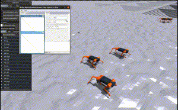
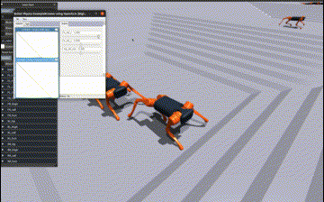
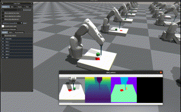

# 师父 (shifu) #

Shifu is a lightweight [IsaacGym](https://github.com/NVIDIA-Omniverse/IsaacGymEnvs) wrapper for robot learning. 
It trains robots in a ***massively parallel*** way like IsaacGym, 
but also it is ***simple to build, highly readable, 
and easily customized***. This project aim to help robot learning researchers 
enjoy the incredible IsaacGym’s few minutes policy training without complex engineering. 

**Maintainer**: Jaylon Wang

**Affiliation**: SenseTime

**Contact**: jwang383@ucsc.edu

中文-[快速入门](https://blog.csdn.net/JaylonW42/article/details/127962458)

### Installation
**We highly recommend creating a conda virtual environment to simplify this process**

Prerequisites for Isaac Gym:
  - Ubuntu 18.04, or 20.04.
  - Python 3.6, 3.7, or 3.8
  - NVIDIA driver version: 470.74 (or above)

1. Install requirements:
   - ```
     pip install -r requirements.txt -f https://download.pytorch.org/whl/cu113/torch_stable.html
     ```
2. Install Isaac Gym:
   - Download [IsaacGym Preview 3](https://developer.nvidia.com/isaac-gym), 
   and follow the instructions in the documentation.
   - Run `joint_monkey.py` for install validation. 
     - **Note**: If there is black window when running, add `export VK_ICD_FILENAMES=/usr/share/vulkan/icd.d/nvidia_icd.json` to your `~/.bashrc`, then run `source ~/.bashrc` may fix it.

3. Install rsl_rl:
   - Clone https://github.com/leggedrobotics/rsl_rl
   - `cd rsl_rl && pip install -e .` 

4. Install shifu
    - Clone this repository
   - `cd shifu && pip install -e .`

## Quickstart Guide

### Example 1: Quadruped Robot with conditional commands on complex terrain

- Task: Control a legged robot A1 walk on complex terrains with various commands like base linear velocity, angular velocity, etc.
- Algorithm: PPO policy network
- Training time: 47.97 minutes

 

Train:

```bash
python -m examples.a1_conditional.a1_conditional -r train
```

play:
```bash
python -m examples.a1_conditional.a1_control_panel
```

### Example 2: Arm Robot with multimodal vision

- Task: Push a cube to the target position using the end effector of an ABB robot by visual observation
- Algorithm:  CNN regressor + PPO policy network
- Training time: 23 minutes (prior info input), 420 minutes (image input)



Train:

```bash
python -m examples.abb_pushbox_vision.a_prior_stage -r train
python -m examples.abb_pushbox_vision.b_regression_stage -r train
python -m examples.abb_pushbox_vision.c_vision_stage -r train
```

Play

```bash
python -m examples.abb_pushbox_vision.a_prior_stage -r play
python -m examples.abb_pushbox_vision.b_regression_stage -r play
python -m examples.abb_pushbox_vision.c_vision_stage -r play
```

### API

**ShifuVecGym**

ShifuVecEnv is an **object-orientated IsaacGym wrapper.** The Pytorch tensors in the IsaacGym 
are directly managed by the Units(robot, objects, and sensors ) objects. 

The style is similar to a [gym](https://github.com/openai/gym) environment: 
- ```__init__```: instantiate units and construct a IsaacGym simulation.
- ```compute_observations```: collect all observation or state for the policy network.
- ```compute_termination```: check the termination or done condition.
- ```build_reward_functions```: build reward functions.(each term will be log to tensorboard automatically)

structure:
```python
import torch
from shifu.gym import ShifuVecEnv

class MyShifuVecEnv(ShifuVecEnv):
    def __init__(self, cfg):
        super(MyShifuVecEnv, self).__init__(cfg)
        self.robot = Robot(RobotConfig())
        self.isg_env.create_envs(robot=self.robot)

    def compute_observations(self):
        self.obs_buf = torch.cat([
            self.robot.base_pose,
            self.actions
        ])

    def compute_termination(self):
        self.fail_buf = self.robot.base_pose[:, 2] < 0.
        self.time_out_buf = self.episode_length_buf > self.max_episode_length
        self.reset_buf = self.time_out_buf | self.fail_buf

    def build_reward_functions(self):
        return [self._success_reward]

    def _success_reward(self):
        return torch.square(self.robot.base_pose[:, 0])
```

**PolicyRunner**

After implementing a ShifuVecEnv, it can be trained by calling the run_policy function with proper config files. 

```python
from shifu.runner import run_policy

run_policy(
        run_mode="train",  # ['train', 'play', 'random']
        env_class=MyShifuVecEnv,
        env_cfg=MyEnvConfig(),
        policy_cfg=MyPPOConfig(),
        log_root="./logs/MyExperiment",
    )
```

### Citing
The training process of example 1 (A1 conditional walking) is simplified version of [legged gym environment](https://leggedrobotics.github.io/legged_gym/)
 by Nikita Rudin, Robotic Systems Lab, ETH Zurich.

The built-in PPO policy module is using [rsl_rl](https://github.com/leggedrobotics/rsl_rl) by Nikita Rudin, Robotic Systems Lab, ETH Zurich.

Training simulation system is [IsaacGymEnvs](https://github.com/NVIDIA-Omniverse/IsaacGymEnvs) by Nvidia.
